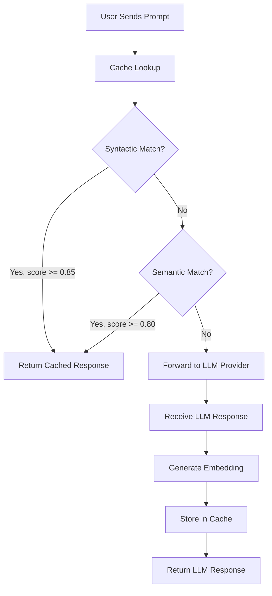

# LLM Response Caching with Similarity Detection

## Table of Contents

1. [Project Overview](#project-overview)
2. [End-to-End Flow](#end-to-end-flow)
3. [Project Structure](#project-structure)
4. [Dependencies](#dependencies)
5. [Deployment](#deployment)
6. [Configuration](#configuration)

---

## Project Overview

This project demonstrates intelligent LLM response caching using both **syntactic** and **semantic** similarity detection. Every LLM request is cached, and subsequent requests that are similar (either by character-level matching or by meaning) are served from the cache without hitting the LLM, saving cost and latency.

### How It Works

1. A user sends a prompt to the service.
2. The service checks if any previously cached prompt is **syntactically similar** (using SequenceMatcher for character-level comparison).
3. If no syntactic match, it checks for **semantic similarity** (using sentence-transformer embeddings and cosine similarity).
4. If a match is found above the configured threshold, the cached response is returned.
5. If no match, the prompt is forwarded to the LLM, and the response is cached with its embedding for future lookups.

---

## End-to-End Flow



---

## Project Structure

```
ai-genai-llm-caching/
├── main.py                    # Application entry point (demo + server mode)
├── config/
│   └── settings.yaml          # External configuration file
├── src/
│   ├── __init__.py
│   ├── api.py                 # FastAPI REST API layer
│   ├── config_loader.py       # YAML + env var configuration loader
│   ├── exceptions.py          # Custom exception classes
│   ├── llm_cache_service.py   # Main service orchestrator
│   ├── logger_setup.py        # Logging configuration
│   ├── cache/
│   │   ├── __init__.py
│   │   ├── cache_manager.py   # Cache coordination and lookup logic
│   │   ├── memory_cache.py    # In-memory LRU cache backend
│   │   └── sqlite_cache.py    # SQLite persistent cache backend
│   ├── llm/
│   │   ├── __init__.py
│   │   ├── llm_client.py      # Abstract LLM client interface
│   │   ├── mock_client.py     # Mock client for testing
│   │   └── openai_client.py   # OpenAI API client implementation
│   ├── models/
│   │   ├── __init__.py
│   │   ├── cache_entry.py     # Cache entry data model
│   │   ├── llm_request.py     # LLM request data model
│   │   └── llm_response.py    # LLM response data model
│   └── similarity/
│       ├── __init__.py
│       ├── semantic_similarity.py   # Embedding-based similarity
│       ├── similarity_engine.py     # Two-tier similarity orchestrator
│       └── syntactic_similarity.py  # Character-level similarity
├── tests/
│   ├── __init__.py
│   ├── test_cache_manager.py
│   ├── test_llm_cache_service.py
│   ├── test_memory_cache.py
│   ├── test_mock_client.py
│   ├── test_semantic_similarity.py
│   └── test_syntactic_similarity.py
├── requirements.txt           # Pinned Python dependencies
├── pyproject.toml             # Project metadata and tool config
├── Dockerfile                 # Container build definition
├── docker-compose.yml         # Multi-container orchestration
├── .env.example               # Environment variable template
└── .gitignore                 # Git exclusion patterns
```

---

## Dependencies

| Package | Purpose |
|---------|---------|
| `openai` | OpenAI API client for LLM requests |
| `sentence-transformers` | Pre-trained models for semantic embeddings |
| `numpy` | Numeric computation for cosine similarity |
| `fastapi` | REST API framework |
| `uvicorn` | ASGI server for FastAPI |
| `pyyaml` | YAML configuration parsing |
| `python-dotenv` | Environment variable loading from .env files |
| `pytest` | Test framework |

---

## Deployment

### Local Development

```bash
# 1. Create and activate a virtual environment
python -m venv venv
source venv/bin/activate  # On Windows: venv\Scripts\activate

# 2. Install dependencies
pip install -r requirements.txt

# 3. Copy and configure environment variables
cp .env.example .env
# Edit .env with your API key (or use provider=mock for testing)

# 4. Run the demo (uses mock LLM by default)
python main.py

# 5. Run in API server mode
python main.py --server

# 6. Run tests
pytest --cov=src
```

### Docker Deployment

```bash
# Build and start the container
docker-compose up --build

# The API will be available at http://localhost:8000
# API docs at http://localhost:8000/docs
```

### API Endpoints

| Method | Endpoint | Description |
|--------|----------|-------------|
| POST | `/query` | Submit a prompt (cached or forwarded to LLM) |
| GET | `/stats` | View cache statistics |
| POST | `/cache/clear-expired` | Remove expired cache entries |
| GET | `/health` | Health check |

---

## Configuration

All configuration is managed through `config/settings.yaml` with environment variable overrides.

### Environment Variable Override Pattern

Environment variables prefixed with `LLM_CACHE_` override YAML config values. Use double underscore (`__`) for nested keys:

```bash
# Override llm.api_key
LLM_CACHE_LLM__API_KEY=sk-xxx

# Override similarity.semantic_threshold
LLM_CACHE_SIMILARITY__SEMANTIC_THRESHOLD=0.75
```

### Key Configuration Values

| Key | Default | Description |
|-----|---------|-------------|
| `cache.backend` | `sqlite` | Storage backend: `memory` or `sqlite` |
| `cache.ttl_seconds` | `86400` | Cache entry expiration (24 hours) |
| `similarity.syntactic_threshold` | `0.85` | Minimum score for syntactic match |
| `similarity.semantic_threshold` | `0.80` | Minimum score for semantic match |
| `similarity.embedding_model` | `all-MiniLM-L6-v2` | Sentence-transformer model |
| `llm.provider` | `openai` | LLM provider: `openai` or `mock` |
| `llm.model` | `gpt-4` | Target LLM model |
